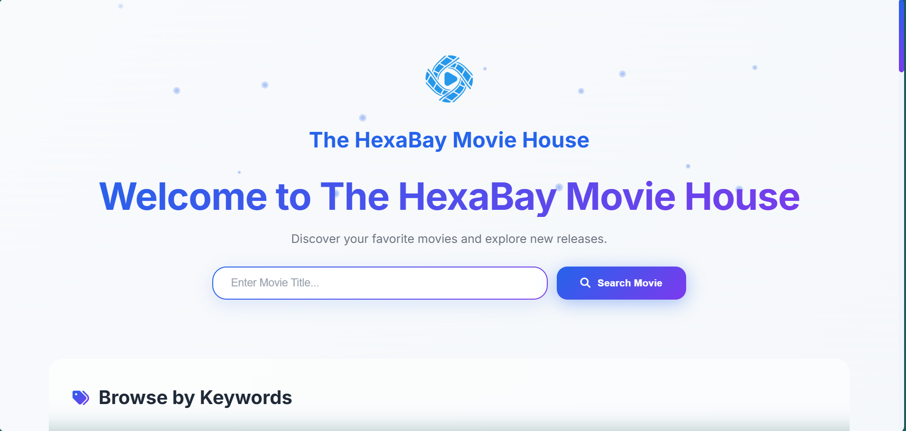
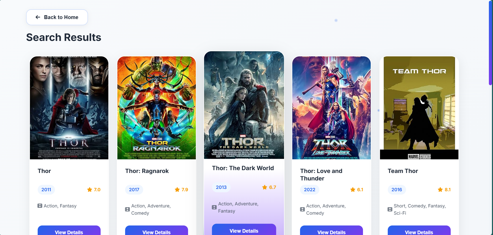
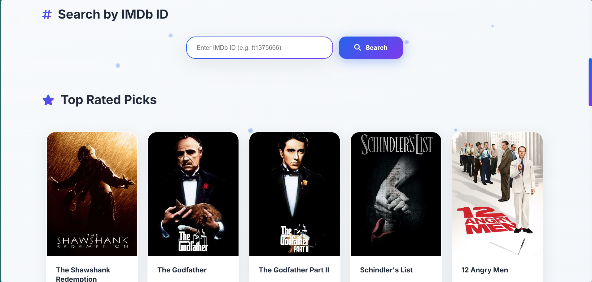
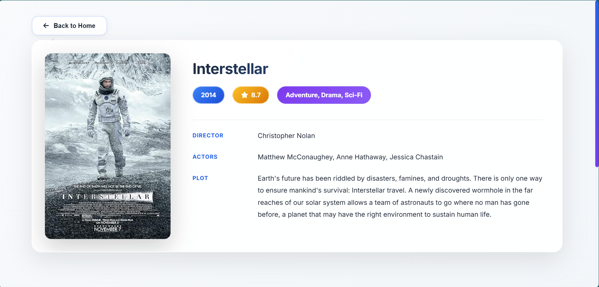

# 🎬 HexaBay Movie House

HexaBay Movie House is a single-page web application that integrates OMDb and TMDb APIs to provide IMDb search, keyword browsing, top-rated carousels, and detailed movie views.

## 📸 Screenshots

> **Home Page**  
> 
>
> **Search Results**  
> 
>
> **Top Rated Movies**  
> 
>
> **Movie Details**  
> 

## 🛠️ Requirements
- Modern browser (Chrome/Firefox/Edge/Safari)
- Internet connection (for API calls)
- API Keys:
  - TMDb API key
  - OMDb API key

## 💻 Tech Stack
- HTML5 – Single-page structure (`index.html`)
- CSS3 – Glassmorphism + responsive UI (`css/style.css`)
- JavaScript (ES6+) – API calls, DOM manipulation (`js/script.js`)
- UI Libraries:
  - Google Fonts (Inter)
  - Font Awesome 6.4 (CDN)
- External APIs:
  - TMDb v3 (`/movie/top_rated`, `/genre/movie/list`, `/movie/{id}?append_to_response=external_ids`)
  - OMDb (`?s=title`, `?i=imdbId&plot=full`)

## ✨ Features
- Home search – Title query (OMDb) + keyword chips (Action, Comedy, Drama, etc.)
- Random pick fallback – Using `sampleMovies` placeholder array
- Top Rated carousel – TMDb data with genre mapping
- IMDb ID search – Home page + dedicated search page
- Movie detail page:
  - If TMDb item has `imdb_id`, fetches full plot & rating from OMDb
  - Otherwise, uses TMDb data as fallback
- Navigation – Page switches without full reload (`switchPage`)

## 📁 Folder Structure
```
index.html        → Layout + sections (home, search, details, ID search, footer)
css/style.css     → Theming, glass panels, responsive tweaks
js/script.js      → API calls, DOM rendering, event wiring
assets/           → Logo & favicon
```

## 🔑 API Key Setup
Top of `js/script.js`:

```js
const TMDb_API_KEY = "d640c039260e8841a05fc2272db13677";
const OMDb_API_KEY = "3df7c428";
```

Note: Replace with your own keys before deploying. Empty strings will disable the related flows.

## 🔄 How Data Flows
- Top Rated: `initializeTopRatedMovies()` → fetch TMDb genres → fetch `/movie/top_rated` → build cards (`createMovieCard`)
- Title Search: `performSearch(query)` → OMDb `?s=` → parallel `?i=` detail fetch → render grid
- Keyword Chips: Call `performSearch(keyword)` (OMDb) or use local filter fallback
- IMDb ID Search: `searchById(imdbId)` → OMDb `?i=` → single card
- Detail View: Click "View Details" → if `data-imdb-id` → `showMovieDetailsByImdb`; else `data-tmdb-id` → `showMovieDetailsByTmdb` (OMDb enrichment applied if available)

## 🚀 Run Locally
1. Clone/download the repository  
2. Open `index.html` in a browser (or use a static server, e.g., `npx serve .`)  
3. Ensure network access for OMDb/TMDb endpoints

## 🌐 Deployment
- Static hosting is sufficient (GitHub Pages / Netlify / Vercel / Cloudflare Pages)  
- Keep API keys secure (use environment-injected build or serverless proxy if publishing publicly)

## ⚠️ Known Limitations / TODOs
- `sampleMovies` array is empty; add offline sample data if needed  
- No proper loading/error states for some fetches (basic alerts only)  
- No rate-limit/backoff handling for API quotas  
- Social links/footer are placeholders

## 🎨 Credits
- Movie data: OMDb API, TMDb API  
- Icons: Font Awesome  
- Fonts: Google Fonts (Inter)
